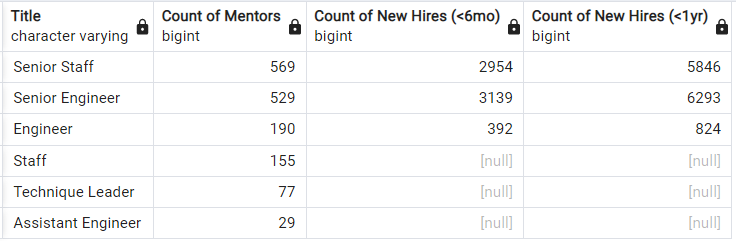

# Pewlett Hackard Retirement Analysis

## Overview

 The Baby Boomer Generation is defined as the subset of the population born during the post-World War II baby boom, hence the apt generation name.  Due to advances in medicine, the large number of people in this generation compared to the preceding and subsequent generations, and changing retirement requirements (e.g. Social Security withdrawal age increasing), baby boomers are living and working longer, which has led to this generation making up a disproportionately large workforce size. As the Baby Boomers near retirement age, then, a sizeable portion of the labor market will leave. The issue pervades nearly all institutions, public and private, and steps must be taken to address the employee gaps left by the retirees.  

Pewlett Hackard, a company with around 240,000 employees, faces this generational problem. The company aims to address and prepare for this "silver tsunami" of retirees by compiling a list of eligible retirees with their job titles. Additionally, we have been tasked with investigating a potential mentorship program of retirees that are likely to retire later than others. To this end, we have been given access to their employee databases to analyze and report on. The provided databases contain, non-exhaustively, employee information, such as birth dates and names; employment titles; employing department; hiring dates; and salaries. We discuss herein what we've learned from a set of SQL queries on the provided databases. For the purposes of our analysis, retirement eligibility was indicated to be those born in the calendar years of 1952-1955.  

## Results

### Employees Eligible for Retirement
- There are 72,458 employees eligible for retirement based on their age.
- Without filtering on uniqueness\*, the query returns a list of 133,776 employees. Because this number is nearly double the previous, it suggests an average of almost one promotion per employee over their tenure at Hewlett Packard. 
    - \*The initial query to produce the retirement_tables.csv file pulled from the employee and title databases without uniqueness constraints. The unique_titles.csv file was built by constraining on *current* employee titles.  
- The break-down of eligible retirees by title is shown in the following table:  

##### Number of Retirement-Eligible Employees by Title
| Current Title | Number | 
|---|---| 
| Senior Engineer | 25916 | 
| Senior Staff | 24926 | 
| Engineer | 9285 | 
| Staff | 7636 | 
| Technique Leader | 3603 |
| Assistant Engineer | 1090 |
| Manager | 2 |

### Employees Eligible for The Mentorship Program

The mentorship program is designed for those that are nearing retirement but won't be soon, so they're available to mentor those employees replacing the retirees. The eligibility to be a mentor is defined as those born in the calendar year 1965.

- There are 1,549 employees that qualify to be a mentor. 
- The break down of eligible mentors by title is shown in the following table:

##### Percentage of Mentorship-Eligible Retirees by Title
| Current Title | Number |
|---|---|
| Senior Engineer | 529 |
| Senior Staff | 569 |
| Engineer | 190 |
| Staff | 155 |
| Technique Leader | 77 |
| Assistant Engineer | 29 |
| Manager | 0 |

## Summary and Discussion

Above, we took a cursory glance at the number of employees eligible for retirement. Let's break it down further to address questions of how many roles we need to replace.

### Number of Potential Retirees

The following query results display fractional numbers of potential retirees by department and title, respectively. The 'Total count' is the total number of employees from the stated 'Department' or with the 'Retiring title'; 'Retiring Count' is the number of retirement-eligible employees fitting that criteria; and 'Percent' is 'Retiring count' over 'Total count'.  

##### Breakdown of Potential Retirees by Department
  
##### Breakdown of Potential Retirees by Title
  

The number of potential retirees is consistent through departments and [non-managerial] positions at ~13.75% and ~30%, respectively.  

So, how many positions need to be filled to replace the potential retirees? Foremost, 2 managers will need to be replaced. Thereafter, filling roles of other titles and departments is less absolute and cost-cutting measures can be taken. With the progression of technology and stream-lined processes, we can conservatively suggest at least 3 retirees can be replaced by 2 new hires/promotions. That is, only about two-thirds of the vacant positions need be filled. The following table summarizes what future employee counts *could* look like by department:  

##### Potential Employee Counts by Department Following Replacement Hires
| Department | Current Total Count | Retiree Count | ~Replacement Count | ~Future Total Count |
|---|---|---|---|---| 
Research           | 16,904 | 2,413 | 1,600 | 16,091
Quality Management | 15,990 | 2,234 | 1,500 | 15,256
Sales              | 42,000 | 5,860 | 3,900 | 40,040
Production         | 58,706 | 8,174 | 5,500 | 56,032
Finance            | 13,850 | 1,908 | 1,300 | 13,242
Human Resources    | 14,260 | 1,953 | 1,300 | 13,607
Customer Service   | 18,978 | 2,597 | 1,700 | 18,081
Development        | 68,392 | 9,281 | 6,200 | 65,311
Marketing          | 16,252 | 2,199 | 1,500 | 15,553

### Fiscal Considerations

On the topic of cost-cutting, we can query for and utilize the salaries of the potential retirees. This allows us to investigate the savings of the replacement scheme noted above. The following tables break down the average salary and summed salaries of the retirees by title and department.

##### Retiring Salaries by Title  
| Title | Average Salary | Sum of Salaries |
|---|---|---|
| Senior Staff | 58,347.62 | 1,454,372,739 |
| Senior Engineer | 48,458.02 | 1,255,837,996 |
| Engineer | 48,507.22 | 450,389,534 |
|Staff | 58,342.56 | 445,503,817 |
| Technique Leader | 48,233.36 | 173,784,813 |
| Assistant Engineer | 48,379.34 | 52,733,484 |
| Manager | 59,612.50 | 119,225 |

##### Retiring Salaries by Department
| Department | Average Salary | Sum of Salaries | Potential Savings\* |
|---|---|---|---|
| Development | 48,580.82 | 892,332,554 | 297,444,185 |
| Sales | 69,680.30 | 789,895,925 | 263,298,642 |
| Production | 48,740.79 | 788,235,976 | 262,745,325 |
| Marketing | 61,016.53 | 267,984,617 | 89,328,206 | 
| Customer Service | 48,286.34 | 256,883,317 | 85,627,772 |
| Research | 48,700.05 | 230,740,860 | 76,913,620 | 
| Finance | 59,539.09 | 223,807,445 | 74,602,482 |
| Quality Management | 46,415.29 | 206,455,205 | 68,818,570 |
| Human Resources | 44,944.13 | 176,405,709 | 58,801,903 |
| Total | 52,896.04 | 3,832,741,608 | 1,277,580,536
\*The potential savings in the table above is calculated with the aforementioned replacement rate of 2 new hires for 3 retirees. Saving over one-and-a-quarter billion dollars in salaries is a welcome change under this plan.

### Mentorship Program

As noted above, there are just over 1,500 future retirees that qualify to be mentors. Shown below is a table with the count of employees that qualify for the mentorship program by department.

##### Percentage of Mentorship-Eligible Retirees by Department
| Current Department | Number |
|---|---|
| Development | 435 | 
| Production | 356 | 
| Sales | 272 | 
| Customer Service | 128 | 
| Marketing | 126 | 
| Research | 113 | 
| Human Resources | 107 | 
| Quality Management | 97 | 
| Finance | 74 | 

For the present discussion, however, we will focus on the titles of the potential mentors. Recall that all title roles included employees that qualifed for the mentorship program except for managers, of which neither qualifed for the mentorship program. The first recommendation regarding the mentorship program is to include the managers since this is a large role, despite them not qualifying based on age.  

The pertinent question is "are there enough mentors for the new hires?" Foremost, we consider a 'new hire' to be someone *outright hired into* the company or *promoted* to a new title (both of which are accomplished at once by querying on the titles table) within a set timeframe. For comparison, we consider new hires hired both within the last six months and twelve months. The most recent hire is from 1 Aug. 2002, which is the value we use for calculating the new hire dates. The following image shows a queried comparison between the number of eligible mentors to the number of new hires, both six months and one year green, by title.

##### Counts of Mentors and New Hires by Title
  

Since there are no new hires as 'staff,' 'technique leader,' or 'assistant engineer,' there are more mentors available for these titles than necessary. We recommend keeping minimal numbers of these employees on as mentors for that reason.  

For the remaining titles, there is a mentor:new hire ratio that roughly varies between 1:6 and 1:10. Thus, the answer is subjective and depends heavily on the nature of the title's role and mentor's responsibility. If the mentor is expected to continue their work in addition to mentoring, a lower ratio is preferred. If the responsibility is solely to mentor, a ratio of 1:10 is still manageable; for example, giving two hours per week to each of the ten new hire mentees works out to a twenty-hour part-time workweek.  

The last comment we make about the mentorship program is to suggest refining the eligibility criteria by adding an employment duration criterion and relaxing the birth year criterion. The role of a mentor should be to ease the new hire into the culture and methods of the company, and this is not well-achieved by older recent hires themselves. While the intent is to enroll employees that are still a few years away from retirement, the reality is that a person hired only 5 years ago and 10 years from retirement qualifies as a mentor over someone that was hired 20 years ago but is 11 years from retirement. To wit, the retirement date (as proxied by birth-year requirement) should be made flexible because less than 700 of the current potential mentors have been at the company for greater than 20 years, which would certainly not be enough mentors for the new hires (per the preceding paragraph).
